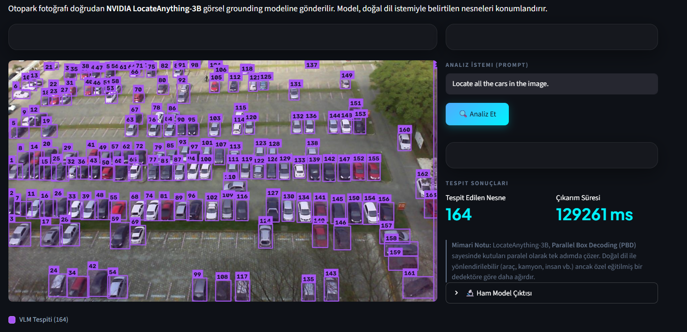
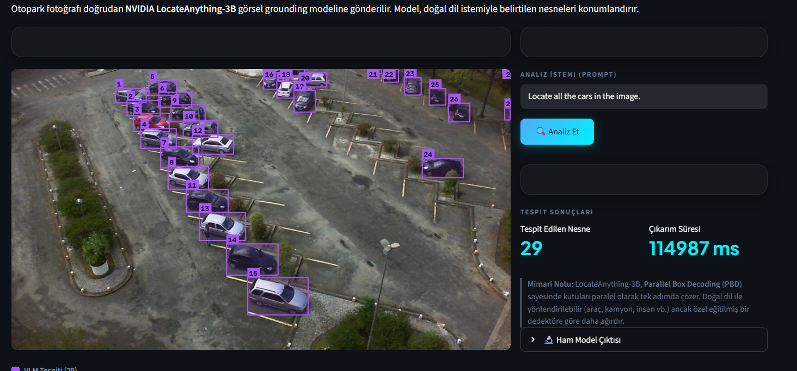

# 🚗 SmartPark AI — Otopark Doluluk & Anomali Tespit Platformu

Üç farklı yapay zeka mimarisini aynı görsel üzerinde karşılaştıran Streamlit uygulaması:

| Yaklaşım | Model | Güçlü Yanı | Zayıf Yanı |
|---|---|---|---|
| **Sadece VLM** | NVIDIA LocateAnything-3B | Doğal dil istemiyle esnek tespit | Ağır model, yüksek gecikme |
| **Sadece YOLO** | YOLO26 (`best.pt`, PKLot ile eğitildi) | Milisaniye hızında boş/dolu tespiti | Yalnızca eğitildiği sınıfları tanır |
| **Hibrit** | YOLO + VLM | YOLO sayar, VLM çapraz doğrular | İki modelin de kurulu olması gerekir |

## Ekran Görüntüleri

LocateAnything-3B, yarı dolu otopark karesinde doğal dil istemiyle **164 aracı** konumlandırıyor:



Aynı model, yağmurlu ve seyrek karede 29 araç buluyor:



## Kurulum

Sanal ortam oluşturup bağımlılıkları yükleyin (Windows / PowerShell):

```powershell
python -m venv .venv
.venv\Scripts\Activate.ps1
pip install -r requirements.txt
```

> **GPU Notu:** `requirements.txt` içindeki `--extra-index-url` satırı sayesinde PyTorch'un
> CUDA 13.0 destekli sürümü otomatik kurulur. LocateAnything-3B (~7.8 GB) ilk çalıştırmada
> Hugging Face'ten otomatik indirilir ve 8 GB VRAM kartlarda 4-bit kuantalanarak yüklenir.

## Çalıştırma

```powershell
.venv\Scripts\Activate.ps1   # sanal ortam aktif değilse
streamlit run app.py
```

Sol menüden bir otopark fotoğrafı yükleyin veya **örnek görsel galerisinden** seçim yapın.
Galeride PKLot veri setinden alınmış, doluluk yelpazesini (%0 → %100) kapsayan 6 gerçek
otopark kamerası karesi ve 1 yapay havadan görsel (zorlu senaryo) bulunur. YOLO modeli
PKLot ile eğitildiğinden en iyi sonuçları 📷 işaretli gerçek karelerde verir.

## Proje Yapısı

```
Parking-VLM-YOLO/
├── app.py                       # Streamlit giriş noktası
├── smartpark/                   # Uygulama paketi
│   ├── config.py                # Sabitler ve dosya yolları
│   ├── visualization.py         # Tespit kutusu çizimi
│   ├── models/
│   │   ├── vlm.py               # LocateAnything-3B yükleme + çıkarım
│   │   └── yolo.py              # YOLO (best.pt) yükleme + çıkarım
│   └── ui/
│       ├── theme.py             # Özel CSS teması
│       ├── components.py        # Lejant, doluluk çubuğu, sidebar, header
│       └── views/
│           ├── vlm_view.py      # Sekme 1: Sadece VLM
│           ├── yolo_view.py     # Sekme 2: Sadece YOLO
│           └── hybrid_view.py   # Sekme 3: Hibrit
├── weights/
│   ├── best.pt                  # PKLot ile eğitilmiş YOLO26 modeli
│   └── yolo26n.pt               # YOLO26-nano baz ağırlıkları
├── assets/
│   ├── otopark_sample.png       # Yapay havadan test görseli (zorlu senaryo)
│   ├── samples/                 # PKLot'tan gerçek kamera kareleri (örnek galerisi)
│   └── screenshots/             # README ekran görüntüleri
├── notebooks/
│   └── yolov26_training.ipynb   # Colab eğitim notebook'u (PKLot, 50 epoch)
├── data/                        # Veri seti ve eğitim çıktısı arşivleri (git'e dahil edilmez)
└── requirements.txt
```

## Model Eğitimi

`notebooks/yolov26_training.ipynb` Google Colab üzerinde çalışacak şekilde hazırlanmıştır:
PKLot veri seti (Roboflow, 416x416) ile `yolo26n.pt` üzerinden 50 epoch eğitim yapar ve
`best.pt` çıktısını üretir. Sınıflar: `space-empty` (boş), `space-occupied` (dolu).

## Veri Seti Atfı

Eğitim verisi ve `assets/samples/` altındaki örnek görseller **PKLot** veri setinden
alınmıştır (CC BY 4.0):

> Almeida, P., Oliveira, L. S., Silva Jr., E., Britto Jr., A., Koerich, A. (2015).
> *PKLot — A robust dataset for parking lot classification.*
> Expert Systems with Applications, 42(11), 4937-4949.

Örnek kareler [Voxel51/PKLot](https://huggingface.co/datasets/Voxel51/PKLot)
(Hugging Face) üzerinden temin edilmiştir.

## Lisans

Bu proje [MIT lisansı](LICENSE) ile lisanslanmıştır.
